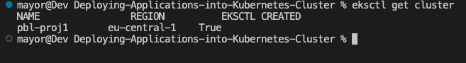

# Deploying Applications Into Kubernetes Cluster

In this project, we will begin to deploy applications on a K8s cluster. Kubernetes has a lot of moving parts; it operates with several layers of abstraction between your application and host machines where it runs.

## Choosing the right Kubernetes cluster set up

When it comes to using a Kubernetes cluster, there is a number of options available depending on the ultimate use of it. For example, if you just need a cluster for development or learning, you can use lightweight tools like [Minikube](https://minikube.sigs.kubernetes.io/docs/start/), or [k3s](https://k3s.io/). These tools can run on your workstation without heavy system requirements. Obviously, there is limit to the amount of workload you can deploy there for testing purposes, but it works exactly like any other Kubernetes cluster.

On the other hand, if you need something more robust, suitable for a production workload and with more advanced capabilities such as horizontal scaling of the worker nodes, then you can consider building own Kubernetes cluster from scratch just as you did in previous project `[Kubernetes Fromn Ground Up]()`.

Other options will be to leverage a [Managed Service](https://www.adept.co.uk/the-benefits-of-cloud-managed-services-for-business/) Kubernetes cluster from public cloud providers such as: [AWS EKS](https://aws.amazon.com/eks), [Microsoft AKS](https://azure.microsoft.com/en-gb/services/kubernetes-service), or [Google Cloud Platform GKE](https://cloud.google.com/kubernetes-engine). There are so many more options out there. Regardless of whichever one you choose, the experience is usually very similar.

Most organisations choose Managed Service options for obvious reasons such as:

1. Less administrative overheads
2. Reduced cost of ownership
3. Improved Security
4. Seamless support
5. Periodical updates to a stable and well-tested version
6. Faster cluster spin up

... and many more

However, there is usually strong reasons why organisations with very strict compliance and security concerns choose to build their own Kubernetes clusters. Most of the companies that go this route will mostly use on-premises data centres. When there is need to store data privately due to its sensitive nature, companies will rather not use a public cloud provider. Because, if they do, they have no idea of the physical location of the data centre in which their data is being persisted. Banks and Governments are typical examples of this.

Some setup options can combine both public and private cloud together. For example, the master nodes, `etcd` clusters, and some worker nodes that run [stateful](https://whatis.techtarget.com/definition/stateful-app) applications can be configured in private datacentres, while worker nodes that require heavy computations and [stateless](https://www.redhat.com/en/topics/cloud-native-apps/stateful-vs-stateless) applications can run in public clouds. This kind of hybrid architecture is ideal to satisfy compliance, while also benefiting from other public cloud capabilities.


## Deploying app using Kubernetes objects

In this section, you will begin to write configuration files for Kubernetes objects (they are usually referred as `manifests`) in the form of files with `yaml` syntax and deploy them using `kubectl` console. But first, let us understand what a Kubernetes object is.

**Kubernetes objects** are persistent entities in the Kubernetes system. Kubernetes uses these entities to represent the state of your cluster. Specifically, they can describe:

- What containerized applications are running (and on which nodes)
- The resources available to those applications
- The policies around how those applications behave, such as restart policies, upgrades, and fault-tolerance

These objects are ***"record of intent"*** - once you create the object, the Kubernetes system will constantly work to ensure that the object exists. By creating an object, you are effectively telling the Kubernetes system what you want your cluster's workload to look like; this is your cluster's desired state.

To work with Kubernetes objects - whether to create, modify, or delete them - you will need to use the Kubernetes API. When you use the `kubectl` command-line interface, for example, the CLI makes the necessary Kubernetes API calls for you. It is also possible to use `curl` to directly interact with the Kubernetes API, or it can be as part of developing a program in different programming languages. That will require some advance knowledge. You can [read more about client libraries](https://kubernetes.io/docs/reference/using-api/client-libraries/) to get an idea on how that works.

### Common Kubernetes objects

- Pod
- Namespace
- ResplicaSet (Manages Pods)
- DeploymentController (Manages Pods)
- StatefulSet
- DaemonSet
- Service
- ConfigMap
- Volume
- Job/Cronjob

The very first concept to understand is the difference between how **Docker** and **Kubernetes** run containers - with Docker, every `docker run` command will run an image (representing an application) as a container. The running container is a Docker's smallest entity, it is the most basic deployable object. Kubernetes on the other hand operates with `pods` instead of containers, a pods encapsulates a container. Kubernetes uses `pods` as its smallest, and most basic deployable object with a unique feature that allows it to run multiple containers within a single Pod. It is not the most common pattern - to have more than one container in a Pod, but there are cases when this capability comes in handy. 

In the world of `docker`, or `docker compose`, to run the Tooling app, you must deploy separate containers for the application and the database. But in the world of Kubernetes, you can run both: application and database containers in the same Pod. When multiple containers run within the same Pod, they can directly communicate with each other as if they were running on the same `localhost`. Although running both the application and database in the same Pod is **NOT** a recommended approach. 

A Pod that contains one container is called `single container pod` and it is the most common Kubernetes use case. A Pod that contains multiple co-related containers is called `multi-container pod`. There are few patterns for multi-container Pods; one of them is the **[sidecar](https://medium.com/bb-tutorials-and-thoughts/kubernetes-learn-sidecar-container-pattern-6d8c21f873d)** container pattern - it means that in the same Pod there is a main container and an auxiliary one that extends and enhances the functionality of the main one without changing it.

### Understanding the common YAML fields for every Kubernetes object

Every Kubernetes object includes object fields that govern the object's configuration:

- **kind**: Represents the type of kubernetes object created. It can be a Pod, DaemonSet, Deployments or Service etc.
- **version**: Kubernetes api version used to create the resource, it can be v1, v1beta and v2. Some of the kubernetes features can be released under beta and available for general public usage.
- **metadata**: provides information about the resource like name of the Pod, namespace under which the Pod will be running,
labels and annotations.
- **spec**: consists of the core information about Pod. Here we will tell kubernetes what would be the expected state of resource, Like container image, number of replicas, environment variables and volumes.
- **status**: consists of information about the running object, status of each container. Status field is supplied and updated by Kubernetes after creation. This is not something you will have to put in the YAML manifest.

### Deploying a random Pod

Lets see what it looks like to have a Pod running in a k8s cluster. This section is just to illustrate and get you to familiarise with how the object's fields work. Lets deploy a basic `Nginx` container to run inside a Pod.

- **apiVersion** is **v1**
- **kind** is **Pod**
- **metatdata** has a name which is set to **nginx-pod**
- The **spec** section has further information about the Pod. Where to find the image to run the container - (This defaults to **Docker Hub**), the port and protocol. The structure is similar for any Kubernetes objects, and you will get to see them all as we progress.

Before proceeding, make sure to have [aws cli](https://docs.aws.amazon.com/cli/latest/userguide/getting-started-install.html), [kubectl](https://pwittrock.github.io/docs/tasks/tools/install-kubectl/) and [eksctl](https://eksctl.io/installation/) configured.

Run `aws configure` and provide neccesary credentials to access your aws account.

Create an eks cluster with the command below

```
eksctl create cluster \
--name pbl-proj1
--region eu-central-1
--nodegroup-name worker-nodes \
--node-type m5.large \
--nodes 2
```

or

`eksctl create cluster --name pbl-proj1 --region eu-central-1 --fargate`

Output

```
2023-11-17 12:38:55 [ℹ]  creating Fargate profile "fp-default" on EKS cluster "pbl-proj1"
2023-11-17 12:43:13 [ℹ]  created Fargate profile "fp-default" on EKS cluster "pbl-proj1"
2023-11-17 12:43:44 [ℹ]  "coredns" is now schedulable onto Fargate
2023-11-17 12:44:47 [ℹ]  "coredns" is now scheduled onto Fargate
2023-11-17 12:44:47 [ℹ]  "coredns" pods are now scheduled onto Fargate
2023-11-17 12:44:47 [ℹ]  waiting for the control plane to become ready
2023-11-17 12:44:48 [✔]  saved kubeconfig as "/Users/mayor/.kube/config"
2023-11-17 12:44:48 [ℹ]  no tasks
2023-11-17 12:44:48 [✔]  all EKS cluster resources for "pbl-proj1" have been created
2023-11-17 12:44:48 [ℹ]  kubectl command should work with "/Users/mayor/.kube/config", try 'kubectl get nodes'
2023-11-17 12:44:48 [✔]  EKS cluster "pbl-proj1" in "eu-central-1" region is ready
```


Run

`aws eks update-kubeconfig --name pbl-proj1 --region eu-central-1`

This updates the kubeconfig file, typically located at ~/.kube/config by default. This file contains the necessary information to authenticate and connect to the cluster

`eksctl get cluster`



Let's proceed

1. Create [a Pod](https://kubernetes.io/docs/concepts/workloads/pods/) `yaml` manifest on your master node

```
sudo cat <<EOF | sudo tee ./nginx-pod.yaml
apiVersion: v1
kind: Pod
metadata:
  name: nginx-pod
spec:
  containers:
  - image: nginx:latest
    name: nginx-pod
    ports:
    - containerPort: 80
      protocol: TCP
EOF
```

2. Apply the manifest with the help of `kubectl`

```
kubectl apply -f nginx-pod.yaml
```

**Output:**

```
pod/nginx-pod created
```

3. Get an output of the pods running in the cluster

```
kubectl get pods
```

**Output:**
```
NAME        READY   STATUS    RESTARTS   AGE
nginx-pod   1/1     Running   0          19m
```

4. If the Pods were not ready for any reason, for example if there are no worker nodes, you will see something like the below output.
   
```
NAME        READY   STATUS    RESTARTS   AGE
nginx-pod   0/1     Pending   0          111s
```

5. To see other fields introduced by kubernetes after you have deployed the resource, simply run below command, and examine the output. You will see other fields that kubernetes updates from time to time to represent the state of the resource within the cluster. `-o` simply means the **output** format.

```
kubectl get pod nginx-pod -o yaml 
```

or

```
kubectl describe pod nginx-pod
```

### Accessing the app from the browser

Now you have a running Pod. What's next?

The ultimate goal of any solution is to access it either through a web portal or some application (e.g., mobile app). We have a Pod with Nginx container, so we need to access it from the browser. But all you have is a running Pod that has its own IP address which cannot be accessed through the browser. To achieve this, we need another Kubernetes object called [**Service**](https://kubernetes.io/docs/concepts/services-networking/service/) to accept our request and pass it on to the Pod.

A service is an object that accepts requests on behalf of the Pods and forwards it to the Pod's IP address. If you run the command below, you will be able to see the Pod's IP address. But there is no way to reach it directly from the outside world.

```
kubectl get pod nginx-pod  -o wide 
```

**Output:**

```
NAME        READY   STATUS    RESTARTS   AGE   IP               NODE                                                      NOMINATED NODE   READINESS GATES
nginx-pod   1/1     Running   0          89s   192.168.153.52   fargate-ip-192-168-153-52.eu-central-1.compute.internal   <none>           <none>
```

Let us try to access the Pod through its IP address from within the K8s cluster. To do this, 

1. We need an image that already has `curl` software installed. You can check this out [here](https://hub.docker.com/r/dareyregistry/curl)

```
dareyregistry/curl
```

2. Run `kubectl` to connect inside the container

```
kubectl run curl --image=dareyregistry/curl -i --tty
```

3. Run `curl` and point to the IP address of the Nginx Pod (*Use the IP address of your own Pod*)

```
# curl -v 192-168-153-52:80
```

**Output:**

```
> GET / HTTP/1.1
> User-Agent: curl/7.35.0
> Host: 192-168-153-52
> Accept: */*
> 
< HTTP/1.1 200 OK
< Server: nginx/1.21.0
< Date: Wed, 15 Nov 2023 21:12:56 GMT
< Content-Type: text/html
< Content-Length: 612
< Last-Modified: Tue, 25 Oct 2023 12:28:56 GMT
< Connection: keep-alive
< ETag: "60aced88-264"
< Accept-Ranges: bytes
< 
<!DOCTYPE html>
<html>
<head>
<title>Welcome to nginx!</title>
<style>
    body {
        width: 35em;
        margin: 0 auto;
        font-family: Tahoma, Verdana, Arial, sans-serif;
    }
</style>
</head>
<body>
<h1>Welcome to nginx!</h1>
<p>If you see this page, the nginx web server is successfully installed and
working. Further configuration is required.</p>

<p>For online documentation and support please refer to
<a href="http://nginx.org/">nginx.org</a>.<br/>
Commercial support is available at
<a href="http://nginx.com/">nginx.com</a>.</p>

<p><em>Thank you for using nginx.</em></p>
</body>
</html>
```

If the use case for your solution is required for internal use ONLY, without public Internet requirement. Then, this should be OK. But in most cases, it is NOT!

Assuming that your requirement is to access the Nginx Pod internally, using the Pod's IP address directly as above is not a reliable choice because Pods are ephemeral. They are not designed to run forever. When they die and another Pod is brought back up, the IP address will change and any application that is using the previous IP address directly will break.

To solve this problem, kubernetes uses **Service** - An object that abstracts the underlining IP addresses of Pods. A service can serve as a load balancer, and a reverse proxy which basically takes the request using a human readable `DNS` name, resolves to a Pod IP that is running and forwards the request to it. This way, you do not need to use an IP address. Rather, you can simply refer to the service name directly.

Let us create a service to access the **Nginx Pod**

1. Create a Service `yaml` manifest file:

```
sudo cat <<EOF | sudo tee ./nginx-service.yaml
apiVersion: v1
kind: Service
metadata:
  name: nginx-service
spec:
  selector:
    app: nginx-pod 
  ports:
    - protocol: TCP
      port: 80
      targetPort: 80
EOF
```

2. Create a `nginx-service` resource by applying your manifest

```
kubectl apply -f nginx-service.yaml
```

**output:**
```
service/nginx-service created
```

3. Check the created service

```
kubectl get service
```

**output:**
```
NAME            TYPE        CLUSTER-IP      EXTERNAL-IP   PORT(S)   AGE
kubernetes      ClusterIP   10.100.0.1      <none>        443/TCP   59m
nginx-service   ClusterIP   10.100.64.232   <none>        80/TCP    12m
```

**Observation:**

The **TYPE** column in the output shows that there are [different service types](https://kubernetes.io/docs/concepts/services-networking/service/#publishing-services-service-types).

- ClusterIP
- NodePort
- LoadBalancer &
- Headless Service

Since we did not specify any type, it is obvious that the default type is **ClusterIP**

Now that we have a service created, how can we access the app? Since there is no public IP address, we can leverage `kubectl` **port-forward** functionality.

```
kubectl  port-forward svc/nginx-service 8089:80
```

**8089** is an arbitrary port number on your laptop or client PC, and we want to tunnel traffic through it to the port number of the `nginx-service` **80**.

Unfortunately, this will not work quite yet. Because there is no way the service will be able to select the actual Pod it is meant to route traffic to. If there are hundreds of Pods running, there must be a way to ensure that the service only forwards requests to the specific Pod it is intended for.

To make this work, you must reconfigure the Pod manifest and introduce **labels** to match the **selectors** key in the field section of the service manifest.

1. Update the Pod manifest with the below and apply the manifest:

```
apiVersion: v1
kind: Pod
metadata:
  name: nginx-pod
  labels:
    app: nginx-pod  
spec:
  containers:
  - image: nginx:latest
    name: nginx-pod
    ports:
    - containerPort: 80
      protocol: TCP
```

Notice that under the metadata section, we have now introduced `labels` with a key field called `app` and its value `nginx-pod`. This matches exactly the `selector` key in the **service** manifest.

The key/value pairs can be anything you specify. These are not Kubernetes specific keywords. As long as it matches the selector, the service object will be able to route traffic to the Pod.

Apply the manifest with: 

```
kubectl apply -f nginx-pod.yaml
```

2. Run kubectl port-forward command again

```
kubectl  port-forward svc/nginx-service 8089:80
```

**output:**
```
kubectl  port-forward svc/nginx-service 8089:80
Forwarding from 127.0.0.1:8089 -> 80
Forwarding from [::1]:8089 -> 80
```

Then go to your web browser and enter `localhost:8089` - You should now be able to see the nginx page in the browser.


Let us try to understand a bit more about how the service object is able to route traffic to the Pod.

If you run the below command:

```
kubectl get service nginx-service -o wide
```

You will get the output similar to this:
```
ginx-service -o wide
NAME            TYPE        CLUSTER-IP      EXTERNAL-IP   PORT(S)   AGE   SELECTOR
nginx-service   ClusterIP   10.100.64.232   <none>        80/TCP    14m   app=nginx-pod
```

As you already know, the service's type is `ClusterIP`, and in the above output, it has the IP address of `10.100.64.232` - This IP works just like an internal loadbalancer. It accepts requests and forwards it to an IP address of any Pod that has the respective `selector` label. In this case, it is `app=nginx-pod`. If there is more than one Pod with that label, service will distribute the traffic to all these pods in a [Round Robin](https://en.wikipedia.org/wiki/Round-robin_scheduling) fashion.

Now, let us have a look at what the Pod looks like:

```
kubectl get pod nginx-pod --show-labels
```

**Output:**
```

NAME        READY   STATUS    RESTARTS   AGE   LABELS
nginx-pod   1/1     Running   0          15m   app=nginx-pod,eks.amazonaws.com/fargate-profile=fp-default
```

***Notice below that the IP address of the Pod, is **NOT** the IP address of the server it is running on. Kubernetes, through the implementation of network plugins assigns virtual IP adrresses to each Pod.***

```
kubectl get pod nginx-pod -o wide
```

**Output:**


Therefore, Service with IP `10.100.64.232` takes request and forwards to Pod with IP `192.168.153.52`

### Expose a Service on a server's public IP address & static port

Sometimes, it may be needed to directly access the application using the public IP of the server (when we speak of a K8s cluster we can replace 'server' with 'node') the Pod is running on. This is when the [**NodePort**](https://kubernetes.io/docs/concepts/services-networking/service/#nodeport) service type comes in handy.

A **Node port** service type exposes the service on a static port on the node's IP address. NodePorts are in the `30000-32767` range by default, which means a NodePort is unlikely to match a service’s intended port (for example, 80 may be exposed as 30080).

Update the nginx-service `yaml` to use a NodePort Service.

```
apiVersion: v1
kind: Service
metadata:
  name: nginx-service
spec:
  type: NodePort
  selector:
    app: nginx-pod
  ports:
    - protocol: TCP
      port: 80
      nodePort: 30080
```

What has changed is:

1. Specified the type of service (Nodeport)
2. Specified the NodePort number to use.

- Allow the inbound traffic in your EC2's Security Group to the NodePort range `30000-32767`
- Get the public IP address of the node the Pod is running on, append the nodeport and access the app through the browser. 

You must understand that the port number `30080` is a port on the node in which the Pod is scheduled to run. If the Pod ever gets rescheduled elsewhere, then the same port number will be used on the new node it is running on. So, if you have multiple Pods running on several nodes at the same time - they all will be exposed on respective nodes' IP addresses with a static port number.

Read some more information regarding Services in Kubernetes in [this article](https://medium.com/avmconsulting-blog/service-types-in-kubernetes-24a1587677d6).

### How Kubernetes ensures desired number of Pods is always running?

When we define a Pod manifest and appy it - we create a Pod that is running until it's terminated for some reason (e.g., error, Node reboot or some other reason), but what if we want to declare that we always need at least 3 replicas of the same Pod running at all times? Then we must use an [**ResplicaSet (RS)**](https://kubernetes.io/docs/concepts/workloads/controllers/replicaset/) object - it's purpose is to  maintain a stable set of Pod replicas running at any given time. As such, it is often used to guarantee the availability of a specified number of identical Pods.

Let us delete our nginx-pod Pod:

```
kubectl delete -f nginx-pod.yaml
```

**Output:**
```
pod "nginx-pod" deleted
```

#### Create a ReplicaSet

Let us create a `rs.yaml` manifest for a ReplicaSet object:

```
apiVersion: apps/v1
kind: ReplicaSet
metadata:
  name: nginx-rs
spec:
  replicas: 3
  selector:
    matchLabels:
      app: nginx-pod
  template:
    metadata:
      name: nginx-pod
      labels:
         app: nginx-pod
    spec:
      containers:
      - image: nginx:latest
        name: nginx-pod
        ports:
        - containerPort: 80
          protocol: TCP
```

```
kubectl apply -f rs.yaml
```

The manifest file of ReplicaSet consist of the following fields:

- apiVersion: This field specifies the version of kubernetes Api to which the object belongs. ReplicaSet belongs to **apps/v1** apiVersion.
- kind: This field specify the type of object for which the manifest belongs to. Here, it is **ReplicaSet**.
- metadata: This field includes the metadata for the object. It mainly includes two fields: name and labels of the ReplicaSet.
- spec: This field specifies the **label selector** to be used to select the Pods, number of replicas of the Pod to be run and the container or list of containers which the Pod will run. In the above example, we are running 3 replicas of nginx container.

Let us check what Pods have been created:

```
kubectl get pods
```

```
NAME              READY   STATUS    RESTARTS   AGE     IP                NODE                                                       NOMINATED NODE   READINESS GATES
nginx-pod-8vdpm   1/1     Running   0          2m25s   192.168.124.52    fargate-ip-192-168-124-52.eu-central-1.compute.internal    <none>           <none>
nginx-pod-trtx6   1/1     Running   0          2m25s   192.168.173.74    fargate-ip-192-168-173-74.eu-central-1.compute.internal    <none>           <none>
nginx-pod-zpg5z   1/1     Running   0          2m25s   192.168.166.213   fargate-ip-192-168-166-213.eu-central-1.compute.internal   <none>           <none>
```

Here we see three `nginx-pods` with some random suffixes (e.g., `-cmt2h`) - it means, that these Pods were created and named automatically by some other object (higher level of abstraction) such as ReplicaSet.

Try to delete one of the Pods:

```
kubectl delete po nginx-pod-8vdpm
```

**Output:**

```
pod "nginx-pod-8vdpm" deleted
```

```
❯ kubectl get pods
NAME              READY   STATUS    RESTARTS   AGE
NAME              READY   STATUS    RESTARTS   AGE
nginx-pod-trtx6   1/1     Running   0          4m12s
nginx-pod-zpg5z   1/1     Running   0          4m12s
nginx-pod-zw2sz   1/1     Running   0          60s
```

You can see, that we still have all 3 Pods, but one has been recreated (can you differentiate the new one?)

Explore the ReplicaSet created:

```
kubectl get rs -o wide
```

**Output:**
```
NAME        DESIRED   CURRENT   READY   AGE   CONTAINERS   IMAGES         SELECTOR
nginx-rs   3         3         3       34m   nginx-pod    nginx:latest   app=nginx-pod
```

Notice, that ReplicaSet understands which Pods to create by using **SELECTOR** key-value pair.

#### Get detailed information of a ReplicaSet

To display detailed information about any Kubernetes object, you can use 2 different commands:

- kubectl **describe** %object_type% %object_name% (e.g. `kubectl describe rs nginx-rs`) 
- kubectl **get** %object_type% %object_name% -o yaml (e.g. `kubectl describe rs nginx-rs -o yaml`)

Try both commands in action and see the difference. Also try **get** with `-o json` instead of `-o yaml` and decide for yourself which output option is more readable for you. 

#### Scale ReplicaSet up and down

In general, there are 2 approaches of [Kubernetes Object Management](https://kubernetes.io/docs/concepts/overview/working-with-objects/object-management/): _imperative_ and _declarative_.

Let us see how we can use both to scale our Replicaset up and down:

**Imperative:**

We can easily scale our ReplicaSet up by specifying the desired number of replicas in an imperative command, like this:

```
kubectl scale rs nginx-rs --replicas=5

replicaset.apps/nginx-rs scaled
```

```
❯ kubectl get pods
NAME             READY   STATUS    RESTARTS   AGE
nginx-rs-5mkwp    1/1     Running   0          67s
nginx-rs-cmt2h    1/1     Running   0          13m
nginx-rs-hkhpl    1/1     Running   0          13m
nginx-rs-hvb9j    1/1     Running   0          13m
nginx-rs-pj2l6    1/1     Running   0          67s
```

Scaling down will work the same way, so scale it down to 3 replicas.

**Declarative:**

Declarative way would be to open our `rs.yaml` manifest, change desired number of replicas in respective section

```
spec:
  replicas: 3
```

and applying the updated manifest:

```
kubectl apply -f rs.yaml
```

There is another method - **'ad-hoc'**, it is definitely not the best practice and we do not recommend using it, but you can edit an existing ReplicaSet with following command:

```
kubectl edit -f rs.yaml
```

#### Advanced label matching

As Kubernetes mature as a technology, so does its features and improvements to k8s objects. `ReplicationControllers` do not meet certain complex business requirements when it comes to using `selectors`. Imagine if you need to select Pods with multiple lables that represents things like:

- **Application tier:** such as Frontend, or Backend
- **Environment:** such as Dev, SIT, QA, Preprod, or Prod

So far, we used a simple selector that just matches a key-value pair and check only 'equality':

```
  selector:
    app: nginx-pod
```

But in some cases, we want ReplicaSet to manage our existing containers that match certain criteria, we can use the same simple label matching or we can use some more complex conditions, such as:

```
 - in
 - not in
 - not equal
 - etc...
```

Let us look at the following manifest file:

```
apiVersion: apps/v1
kind: ReplicaSet
metadata: 
  name: nginx-rsV2
spec:
  replicas: 3
  selector:
    matchLabels:
      env: prod
    matchExpressions:
    - { key: tier, operator: In, values: [frontend] }
  template:
    metadata:
      name: nginx
      labels: 
        env: prod
        tier: frontend
    spec:
      containers:
      - name: nginx-container
        image: nginx:latest
        ports:
        - containerPort: 80
          protocol: TCP
```

In the above spec file, under the selector, **matchLabels** and **matchExpression** are used to specify the key-value pair. The **matchLabel** works exactly the same way as the equality-based selector, and the matchExpression is used to specify the set based selectors. This feature is the main differentiator between **ReplicaSet** and previously mentioned obsolete **ReplicationController**. 

Get the replication set:
 
```
kubectl get rs nginx-rs -o wide

NAME       DESIRED   CURRENT   READY   AGE     CONTAINERS        IMAGES         SELECTOR
nginx-rs   3         3         3       5m34s   nginx-container   nginx:latest   env=prod,tier in (frontend)
```

### Using AWS Load Balancer to access your service in Kubernetes

***Note:*** *You will only be able to test this using AWS EKS. You do not have to set this up in current project yet. In the next project, we will update your Terraform code to build an EKS cluster.*

You have previously accessed the Nginx service through **ClusterIP**, and **NodeIP**, but there is another service type - [**Loadbalancer**](https://kubernetes.io/docs/concepts/services-networking/service/#loadbalancer). This type of service does not only create a **Service** object in K8s, but also provisions a real external Load Balancer (e.g. [Elastic Load Balancer - ELB](https://aws.amazon.com/elasticloadbalancing/) in AWS)

To get the experience of this service type, update your service manifest and use the **LoadBalancer** type. Also, ensure that the selector references the Pods in the replica set.

```
apiVersion: v1
kind: Service
metadata:
  name: nginx-service
spec:
  type: LoadBalancer
  selector:
    tier: frontend
  ports:
    - protocol: TCP
      port: 80 # This is the port the Loadbalancer is listening at
      targetPort: 80 # This is the port the container is listening at
```

Apply the configuration:

```
kubectl apply -f nginx-service.yaml
```

Get the newly created service :

```
kubectl get service nginx-service
```

**output:**

```
NAME            TYPE           CLUSTER-IP      EXTERNAL-IP                                                                  PORT(S)        AGE
NAME            TYPE           CLUSTER-IP      EXTERNAL-IP                                                                  PORT(S)        AGE
nginx-service   LoadBalancer   10.100.64.232   aa05ae9dd5d5949e09823cc1777b3420-2054247007.eu-central-1.elb.amazonaws.com   80:30080/TCP   66m
```

An ELB resource will be created in your AWS console.


A Kubernetes component in the control plane called **[Cloud-controller-manager](https://kubernetes.io/docs/concepts/architecture/cloud-controller)** is responsible for triggering this action. It connects to your specific cloud provider's (AWS) APIs and create resources such as Load balancers. It will ensure that the resource is appropriately tagged:


Get the output of the entire `yaml` for the service. You will some additional  information about this service in which you did not define them in the yaml manifest. Kubernetes did this for you.

```
kubectl get service nginx-service -o yaml
```

**output:**

```
apiVersion: v1
kind: Service
metadata:
  annotations:
    kubectl.kubernetes.io/last-applied-configuration: |
      {"apiVersion":"v1","kind":"Service","metadata":{"annotations":{},"name":"nginx-service","namespace":"default"},"spec":{"ports":[{"port":80,"protocol":"TCP","targetPort":80}],"selector":{"tier":"frontend"},"type":"LoadBalancer"}}
  creationTimestamp: "2023-11-17T13:20:40Z"
  finalizers:
  - service.kubernetes.io/load-balancer-cleanup
  name: nginx-service
  namespace: default
  resourceVersion: "22176"
  uid: a05ae9dd-5d59-49e0-9823-cc1777b3420a
spec:
  allocateLoadBalancerNodePorts: true
  clusterIP: 10.100.64.232
  clusterIPs:
  - 10.100.64.232
  externalTrafficPolicy: Cluster
  internalTrafficPolicy: Cluster
  ipFamilies:
  - IPv4
  ipFamilyPolicy: SingleStack
  ports:
  - nodePort: 30080
    port: 80
    protocol: TCP
    targetPort: 80
  selector:
    tier: frontend
  sessionAffinity: None
  type: LoadBalancer
status:
  loadBalancer:
    ingress:
    - hostname: aa05ae9dd5d5949e09823cc1777b3420-2054247007.eu-central-1.elb.amazonaws.com
```

1. A clusterIP key is updated in the manifest and assigned an IP address. Even though you have specified a `Loadbalancer` service type, internally it still requires a clusterIP to route the external traffic through.

2. In the ports section, `nodePort` is still used. This is because Kubernetes still needs to use a dedicated port on the worker node to route the traffic through. Ensure that port range `30000-32767` is opened in your inbound Security Group configuration.

3. More information about the provisioned balancer is also published in the `.status.loadBalancer` field.

```
status:
  loadBalancer:
    ingress:
    - hostname: aa05ae9dd5d5949e09823cc1777b3420-2054247007.eu-central-1.elb.amazonaws.com
```

Copy and paste the load balancer's address to the browser, and you will access the Nginx service

### Do not Use Replication Controllers - Use **Deployment** Controllers Instead

Kubernetes is loaded with a lot of features, and with its vibrant open source community, these features are constantly evolving and adding up.

Previously, you have seen the improvements from **ReplicationControllers (RC)**, to **ReplicaSets (RS)**. In this section you will see another K8s object which is highly recommended over Replication objects (RC and RS).

A [**Deployment**](https://kubernetes.io/docs/concepts/workloads/controllers/deployment/) is another layer above ReplicaSets and Pods, newer and more advanced level concept than ReplicaSets. It manages the deployment of ReplicaSets and allows for easy updating of a ReplicaSet as well as the ability to roll back to a previous version of deployment. It is declarative and can be used for rolling updates of micro-services, ensuring there is no downtime.

Officially, it is highly recommended to use **Deployments** to manage replica sets rather than using replica sets directly.

Let us see Deployment in action.

1. Delete the ReplicaSet

```
kubectl delete rs nginx-rs
```

2. Understand the layout of the `deployment.yaml` manifest below.
Lets go through the 3 separated sections:

```
# Section 1 - This is the part that defines the deployment
apiVersion: apps/v1
kind: Deployment
metadata:
  name: nginx-deployment
  labels:
    tier: frontend

# Section 2 - This is the Replica set layer controlled by the deployment
spec:
  replicas: 3
  selector:
    matchLabels:
      tier: frontend

# Section 3 - This is the Pod section controlled by the deployment and selected by the replica set in section 2.
  template:
    metadata:
      labels:
        tier: frontend
    spec:
      containers:
      - name: nginx
        image: nginx:latest
        ports:
        - containerPort: 80
```

3. Putting them altogether

```
apiVersion: apps/v1
kind: Deployment
metadata:
  name: nginx-deployment
  labels:
    tier: frontend
spec:
  replicas: 3
  selector:
    matchLabels:
      tier: frontend
  template:
    metadata:
      labels:
        tier: frontend
    spec:
      containers:
      - name: nginx
        image: nginx:latest
        ports:
        - containerPort: 80
```

```
kubectl apply -f deployment.yaml
```

Run commands to get the following

1. Get the Deployment

`kubectl get deployment`

```
NAME               READY   UP-TO-DATE   AVAILABLE   AGE
nginx-deployment   3/3     3            3           39s
```

2. Get the ReplicaSet

`kubectl get rs`

```
NAME                          DESIRED   CURRENT   READY   AGE
nginx-deployment-7d476d754d   3         3         3       96s
```

3. Get the Pods

`kubectl get pods`

```
NAME                                READY   STATUS    RESTARTS   AGE
nginx-deployment-7d476d754d-2f745   1/1     Running   0          2m19s
nginx-deployment-7d476d754d-cck2h   1/1     Running   0          2m19s
nginx-deployment-7d476d754d-ksfcr   1/1     Running   0          2m19s
```

4. Scale the replicas in the Deployment to 15 Pods

`kubectl scale deployment nginx-deployment --replicas=15`

```
NAME                                READY   STATUS    RESTARTS   AGE
nginx-deployment-7d476d754d-2f745   1/1     Running   0          8m26s
nginx-deployment-7d476d754d-6nqx9   1/1     Running   0          2m21s
nginx-deployment-7d476d754d-8skc8   1/1     Running   0          2m21s
nginx-deployment-7d476d754d-9z852   1/1     Running   0          2m21s
nginx-deployment-7d476d754d-c5ftf   1/1     Running   0          2m21s
nginx-deployment-7d476d754d-cck2h   1/1     Running   0          8m26s
nginx-deployment-7d476d754d-f586r   1/1     Running   0          2m21s
nginx-deployment-7d476d754d-ksfcr   1/1     Running   0          8m26s
nginx-deployment-7d476d754d-lcj97   1/1     Running   0          2m21s
nginx-deployment-7d476d754d-p6df6   1/1     Running   0          2m21s
nginx-deployment-7d476d754d-r5xnx   1/1     Running   0          2m21s
nginx-deployment-7d476d754d-rjp7n   1/1     Running   0          2m21s
nginx-deployment-7d476d754d-v5ngq   1/1     Running   0          2m21s
nginx-deployment-7d476d754d-vvqm9   1/1     Running   0          2m21s
nginx-deployment-7d476d754d-wlpjz   1/1     Running   0          2m21s
```

5. Exec into one of the Pod's container to run Linux commands

```
kubectl exec -it nginx-deployment-7d476d754d-2f745 -- bash
```

List the files and folders in the Nginx directory

```
root@nginx-deployment-7d476d754d-2f745:/# ls -ltr /etc/nginx/
total 32
-rw-r--r-- 1 root root  664 Oct 24 13:46 uwsgi_params
-rw-r--r-- 1 root root  636 Oct 24 13:46 scgi_params
-rw-r--r-- 1 root root 5349 Oct 24 13:46 mime.types
-rw-r--r-- 1 root root 1007 Oct 24 13:46 fastcgi_params
-rw-r--r-- 1 root root  648 Oct 24 16:10 nginx.conf
lrwxrwxrwx 1 root root   22 Oct 24 16:10 modules -> /usr/lib/nginx/modules
drwxr-xr-x 1 root root 4096 Nov 17 14:58 conf.d
```

Check the content of the default Nginx configuration file

```
root@nginx-deployment-7d476d754d-2f745:/# cat  /etc/nginx/conf.d/default.conf
server {
    listen       80;
    listen  [::]:80;
    server_name  localhost;

    #access_log  /var/log/nginx/host.access.log  main;

    location / {
        root   /usr/share/nginx/html;
        index  index.html index.htm;
    }

    #error_page  404              /404.html;

    # redirect server error pages to the static page /50x.html
    #
    error_page   500 502 503 504  /50x.html;
    location = /50x.html {
        root   /usr/share/nginx/html;
    }

    # proxy the PHP scripts to Apache listening on 127.0.0.1:80
    #
    #location ~ \.php$ {
    #    proxy_pass   http://127.0.0.1;
    #}

    # pass the PHP scripts to FastCGI server listening on 127.0.0.1:9000
    #
    #location ~ \.php$ {
    #    root           html;
    #    fastcgi_pass   127.0.0.1:9000;
    #    fastcgi_index  index.php;
    #    fastcgi_param  SCRIPT_FILENAME  /scripts$fastcgi_script_name;
    #    include        fastcgi_params;
    #}

    # deny access to .htaccess files, if Apache's document root
    # concurs with nginx's one
    #
    #location ~ /\.ht {
    #    deny  all;
    #}
}
```

Now, as we have got acquainted with most common Kubernetes workloads to deploy applications: 

it is time to explore how Kubernetes is able to manage persistent data.


#### Persisting Data for Pods

Deployments are stateless by design. Hence, any data stored inside the Pod's container does not persist when the Pod dies. 

If you were to update the content of the `index.html` file inside the container, and the Pod dies, that content will be lost since a new Pod will replace the dead one.

Let us try that:

1. Scale the Pods down to 1 replica.

`kubectl scale deployment nginx-deployment --replicas=1`

```
NAME                                READY   STATUS    RESTARTS   AGE
nginx-deployment-56466d4948-tg9j8   1/1     Running   0          64m
```

2. Exec into the running container

```
kubectl exec -it nginx-deployment-56466d4948-tg9j8 -- bash
```

3. Install `vim` so that you can edit the file

```
apt-get update
apt-get install vim
```

4. Update the content of the file and add the code below `/usr/share/nginx/html/index.html`

```
<!DOCTYPE html>
<html>
<head>
<title>Welcome to MAYORFAJ.IO!</title>
<style>
    body {
        width: 35em;
        margin: 0 auto;
        font-family: Tahoma, Verdana, Arial, sans-serif;
    }
</style>
</head>
<body>
<h1>Welcome to MAYORFAJ.IO!</h1>
<p>I am happy implementing Kubernetes</p>

<p>Learning by doing is absolutely the best strategy at 
<a href="https://darey.io/">www.darey.io</a>.<br/>
for skills acquisition
<a href="https://darey.io/">www.mayorfaj.io</a>.</p>

<p><em>Thank you for learning from MAYORFAJ.IO</em></p>
</body>
</html>
```

5. Check the browser - You should see this


6. Now, delete the only running Pod so that a new one is automatically recreated.

```
 kubectl delete po nginx-deployment-56466d4948-tg9j8
pod "nginx-deployment-56466d4948-tg9j8" deleted
```

7. Refresh the web page - You will see that the content you saved in the container is no longer there. That is because Pods do not store data when they are being recreated - that is why they are called `ephemeral` or `stateless`. (*But not to worry, we will address this with persistent volumes in the next project*)
  
Storage is a critical part of running containers, and Kubernetes offers some powerful primitives for managing it. **Dynamic volume provisioning**, a feature unique to Kubernetes, which allows storage volumes to be created on-demand. Without dynamic provisioning, DevOps engineers must manually make calls to the cloud or storage provider to create new storage volumes, and then create **PersistentVolume** objects to represent them in Kubernetes. The dynamic provisioning feature eliminates the need for DevOps to pre-provision storage. Instead, it automatically provisions storage when it is requested by users.

To make the data persist in case of a Pod's failure, you will need to configure the Pod to use **Volumes**:

**Clean up the deployment**

```
kubectl delete deployment nginx-deployment
```

```
eksctl delete cluster --name pbl-proj1 --region eu-central-1
```

[Link to Next Project](https://github.com/MayorFaj/Persisting-Data-in_kubernetes_P23.git)
